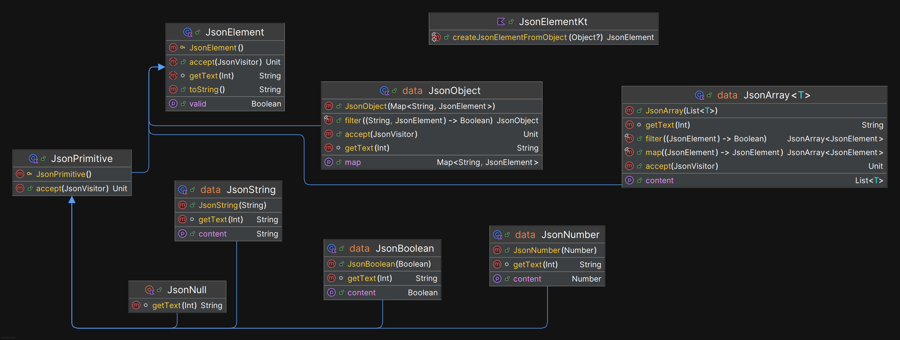

# Tutorial da Biblioteca JSON em Kotlin

Este tutorial mostra como utilizar uma biblioteca personalizada para gerar e manipular estruturas JSON em Kotlin. A biblioteca é baseada em *sealed classes*, herança, o *Visitor Pattern* e também reflexão. \
Abaixo, encontra-se uma demonstração de como usar esta biblioteca.

---
**Release** : [versão 1.0.0](out/artifacts/json_lib/PA.jar)\
**Documentação** : [versão 1.0.0](https://pjpfz-iscte.github.io/PA/)

---

## Estrutura da Biblioteca

A biblioteca inclui os seguintes componentes principais:

### Classes Base:

* `JsonElement`: classe base abstrata para qualquer elemento JSON.
* `JsonPrimitive`: para valores primitivos (`JsonString`, `JsonNumber`, `JsonBoolean`, `JsonNull`).
* `JsonArray<T>`: representa arrays JSON.
* `JsonObject`: representa objetos JSON.

### Funcionalidades:

* `getText(indentLevel: Int)`: devolve a representação formatada em string do JSON.
* `accept(visitor: JsonVisitor)`: permite usar o padrão Visitor para percorrer os elementos.
* `isValid()`: valida a estrutura usando o visitor `JsonValidator`.
* `createJsonElementFromObject(value: Any?)`: converte objetos Kotlin em `JsonElement`s.



---

## Exemplo de Utilização
### Instanciação de elementos JSON
```kotlin
val jsonString = JsonString("Olá")
val jsonNumber = JsonNumber(42)
val jsonBoolean = JsonBoolean(true)
val jsonNull = JsonNull
```

### Criar um JsonArray
```kotlin
val array = JsonArray(listOf(JsonString("um"), JsonString("dois"), JsonNumber(3)))
println(array)  // Output formatado como JSON
```

### Filtrar elementos de um array
```kotlin
val onlyStrings = array.filter { it is JsonString }
println(onlyStrings)
```

### Mapear elementos de um array
```kotlin
val uppercased = array.map {
    if (it is JsonString) JsonString(it.content.uppercase())
    else it
}
println(uppercased)
```

### Criar um JsonObject
```kotlin
val obj = JsonObject(
    mapOf(
        "nome" to JsonString("Rui"),
        "idade" to JsonNumber(30),
        "ativa" to JsonBoolean(true)
    )
)
println(obj)
```

### Filtrar campos de um objeto
```kotlin
val onlyStrings = obj.filter { _, v -> v is JsonString }
println(onlyStrings)
```

### Validação de JSON
Todos os elementos podem ser validados com o método `isValid()`:
```kotlin
val isValid = obj.isValid()
println("JSON válido? $isValid")
```

### Conversão automática com createJsonElementFromObject
Permite converter objetos Kotlin em elementos JSON:

```kotlin
data class Pessoa(val nome: String, val idade: Int)

val pessoa = Pessoa("Rui", 30)
val json = createJsonElementFromObject(pessoa)
println(json)
```

Também suporta:

`List`, `Map<String, *>`, `enums`, `nulls`, e tipos primitivos

### Visitação com accept(visitor)
A biblioteca usa o Visitor Pattern para validar ou percorrer elementos:

```kotlin
val json = JsonString("exemplo")
val validator = JsonValidator()
json.accept(validator)
println("É válido? ${validator.isValidJson()}")
```

## Conclusão

Esta biblioteca permite representar JSONs complexos em Kotlin de forma estruturada e segura, com suporte à validação e transformação. Ideal para aplicações que exigem conversão dinâmica de objetos Kotlin para JSON com elevado controlo.

---

Esta biblioteca foi desenvolvida no âmbito da unidade curricular **Progração Avançada**, lecionada no 2º semestre do ano letivo 2024/25 no Mestrado em Engenharia Informática do ISCTE-Instituto Universitário de Lisboa, pelos alunos Filipa Franco nº99142 e Pedro Ferraz nº100015.
